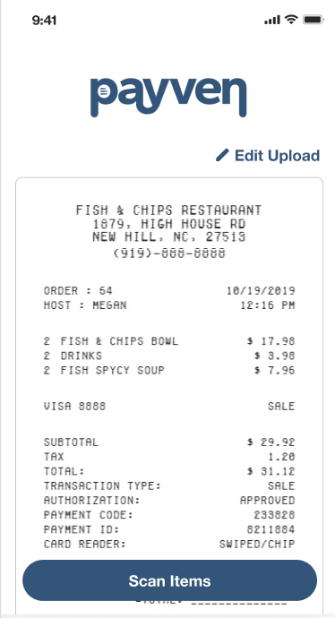

## Overview

[Payven](https://payven.app) creates a live link to split restaurant receipts with your friends. I built Payven for my friends after a 12-person trip to Costa Rica, where $285 went missing over shared dining.

Unlike tools like Splitwise which work by manually entering expenses, Payven automatically scans all line items from a receipt and creates a live link for everyone to tap what they ordered. At the end, it provides options to Venmo or Zelle the host who paid.

## Technical Details

- Frontend: Next.js with Tailwind CSS deployed on Vercel
- Backend: AWS Lambda functions + Textract for OCR

# Screenshots

  
  
  

