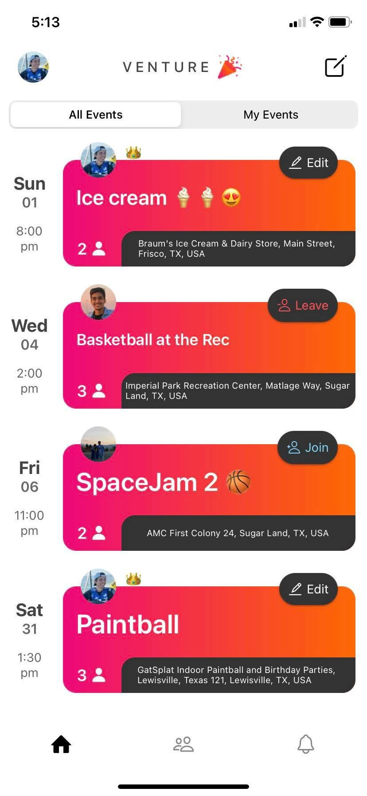

## Overview

Venture is an iOS app that helps users discover and share local events and activities in their community. I built it with my roommate in college, as we wanted a platform for our friends to share different events they were hosting (poker nights, playing basketball, coffee shop study sessions) so we could spontaneously join.

## Technical Details

- Built with React Native for cross-platform mobile development
- Node.js backend with RESTful API
- Real-time event sharing and discovery features

## Screenshots

